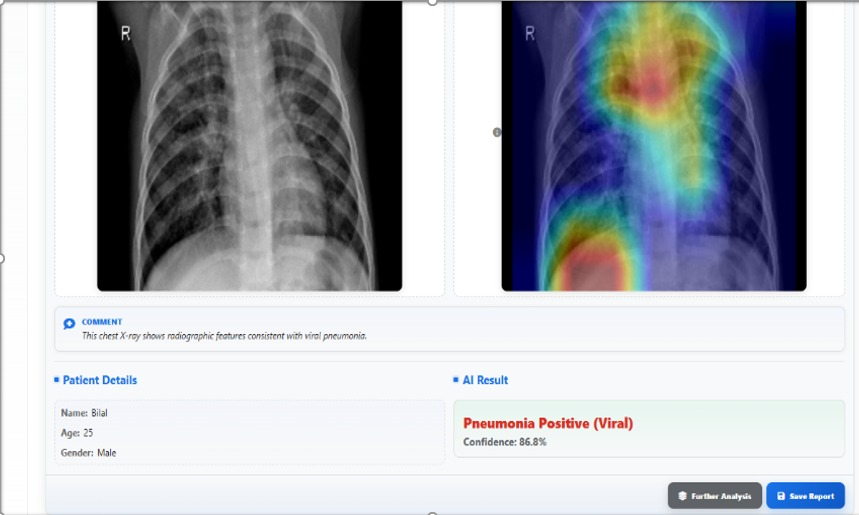
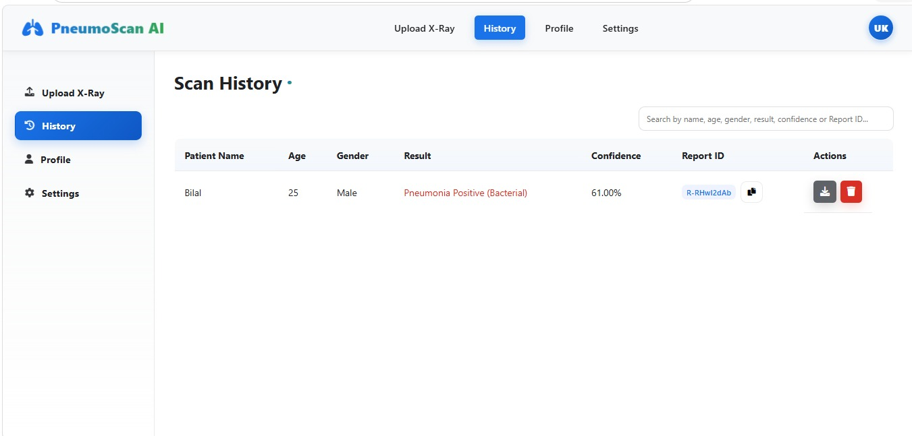

# AI-Powered Pneumonia Detection System

## Introduction

The AI-Powered Pneumonia Detection System is my Final Year Project developed during my BS Information Technology degree. The project focuses on the use of Artificial Intelligence and Deep Learning for the analysis of chest X-ray images.

The main purpose of the project was to develop a complete system instead of limiting the work to model training only. The final application combines deep learning models with a web-based interface where users can upload chest X-ray images and receive predictions generated by trained models.

The project covers different stages of development including dataset preparation, model experimentation, model training, evaluation, backend integration, frontend development, authentication, database services, and deployment-related configuration.

## Project Objective

The main objective of this project was to investigate how deep learning can be used to classify chest X-ray images and how trained machine learning models can be integrated into a practical software application.

The system was developed around two separate classification stages. The first stage identifies whether a chest X-ray is normal or shows signs of pneumonia. If pneumonia is detected, the second stage performs further classification to determine whether the pneumonia is bacterial or viral.

This approach allowed the project to separate pneumonia detection from pneumonia subtype classification.

## Two-Stage Classification Approach

The first model performs binary classification. It receives a chest X-ray image and classifies it as either Normal or Pneumonia.

The final Stage 1 model achieved an accuracy of approximately 98.5 percent during evaluation.

If the first model identifies the image as pneumonia, the image is then processed by the second model.

The second model classifies pneumonia cases into Bacterial Pneumonia or Viral Pneumonia. The final Stage 2 model achieved an accuracy of approximately 89.5 percent.

Both models are based on EfficientNetB0, which was selected after experimenting with different deep learning architectures and evaluating their performance.

## Model Development

The machine learning part of the project was developed using Python, TensorFlow, and Keras.

Google Colab was used for model training and experimentation because it provided access to a suitable Python environment and GPU resources.

During development, different convolutional neural network and transfer learning architectures were tested. These experiments included EfficientNet, DenseNet, MobileNet, and CNN-based approaches.

The final implementation uses EfficientNetB0 for both classification stages.

The trained models included in the project are:

`efficientnetb0_stage1_norm_vs_pneu_fixed.keras`

and

`New_efficientnetb0_stage2_bac_vs_vir.keras`

These model files are stored inside the `server/model` directory.

## Dataset Preparation

The dataset used in this project was created by combining chest X-ray images from multiple publicly available datasets.

The data was organized into three main categories:

- Normal
- Bacterial Pneumonia
- Viral Pneumonia

The original datasets also contained additional categories that were not required for this project. These classes were excluded during the dataset preparation process so that the final dataset matched the objectives of the two-stage classification system.

The preparation process involved organizing the images into consistent folders, checking the available classes, preparing the data for model training, and creating suitable training and evaluation sets.

The complete dataset preparation code and its outputs are included in the Colab notebooks available in this repository.

The full raw chest X-ray dataset is not included in the GitHub repository because of its size. The repository instead contains the code and notebooks used to prepare and process the dataset.

## Model Evaluation

Both final models were evaluated separately.

The Stage 1 model was evaluated for its ability to distinguish between Normal and Pneumonia chest X-rays.

The Stage 2 model was evaluated for its ability to distinguish between Bacterial and Viral Pneumonia.

The evaluation work includes metrics such as accuracy, precision, recall, F1-score, confusion matrices, and ROC curves.

Dedicated evaluation notebooks are included in the repository:

`Stage_1_Model_Evaluation_Report.ipynb`

`Stage_2_Model_Evaluation_Report.ipynb`

The notebooks contain the code as well as saved outputs so that the evaluation process and results can be reviewed directly.

## Google Colab Work

All major machine learning work performed during the development of this project has been included in the `Colab Notebook` folder.

The folder contains notebooks for dataset preparation, model training, testing, comparison of different architectures, final model development, and model evaluation.

Some of the notebooks included in the project are:

- Complete Code of 2 Stages Model
- Models Testing Pipeline
- Pneumonia Complete Code for Dataset
- Stage 1 Model Evaluation Report
- Stage 2 Model Evaluation Report
- DenseNet121 Stage 2 Experiment
- DenseNet169 Pneumonia Model and Evaluation
- EfficientNetB4 Stage 2 Experiment
- MobileNetV2 Pneumonia Experiment
- CNN Pneumonia Model Evaluation

These notebooks were included to show the development process behind the final models rather than only presenting the finished application.

## Web Application

The machine learning models were integrated into a web-based application.

The application allows users to create accounts, sign in, upload chest X-ray images, receive AI-generated predictions, and view previous results.

The frontend was developed using HTML, CSS, and JavaScript.

The Python backend is responsible for loading the trained models, processing uploaded images, performing predictions, and returning the results to the web interface.

The backend implementation is available in:

`server/app.py`

## Authentication and Database

Firebase was used for several application services.

The project includes Firebase authentication for user accounts and Firebase-related configuration for application data management.

The repository also contains Firebase Functions, Firestore rules, Data Connect configuration, and other supporting files used during development.

This part of the project allowed the AI models to be integrated into a more complete software application instead of operating only as standalone Python notebooks.

## Application Features

The system contains user-facing as well as administrative functionality.

Users can create an account and sign into the system. After authentication, they can upload a chest X-ray image for analysis.

The system processes the uploaded image using the trained deep learning models and presents the prediction result through the web interface.

The application also includes prediction history and result management.

Separate interfaces were developed for users, radiologists, and administrative functionality.

## Application Screenshots

### Sign In Page


### Create Account


### Image Upload


### Prediction Results



### Prediction History



### Radiologist Dashboard


### Admin Login


### Admin Dashboard


## Technologies Used

The project combines technologies from machine learning, backend development, frontend development, and cloud services.

The machine learning component was developed using Python, TensorFlow, Keras, EfficientNetB0, NumPy, Scikit-learn, Matplotlib, and Google Colab.

The backend was developed in Python and is responsible for model inference and communication with the frontend.

The frontend was developed using HTML, CSS, and JavaScript.

Firebase was used for authentication, database-related functionality, Firestore configuration, Firebase Functions, and Data Connect.

Node.js was also used for some supporting application services.

## Repository Structure

The repository contains the complete source code of the application together with the machine learning notebooks and trained models.

The main folders are:

`Colab Notebook`  
Contains model training, dataset preparation, testing, and evaluation notebooks.

`css`  
Contains the styling files used by the frontend.

`pages`  
Contains the main HTML pages and related JavaScript files.

`images`  
Contains screenshots and image assets used by the project.

`server`  
Contains the Python backend and trained deep learning models.

`functions`  
Contains Firebase Functions and related configuration.

`email-server`  
Contains the supporting email server implementation.

`dataconnect`  
Contains Firebase Data Connect files.

`src`  
Contains generated and supporting Data Connect source files.

## Running the Project

The repository can be cloned using:

```bash
git clone https://github.com/UmairKhan754/Pneumonia_Detection_System.git